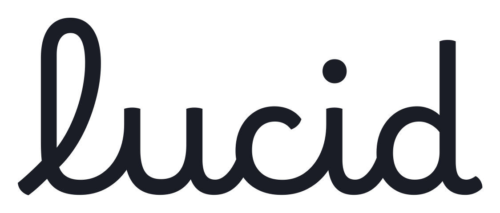
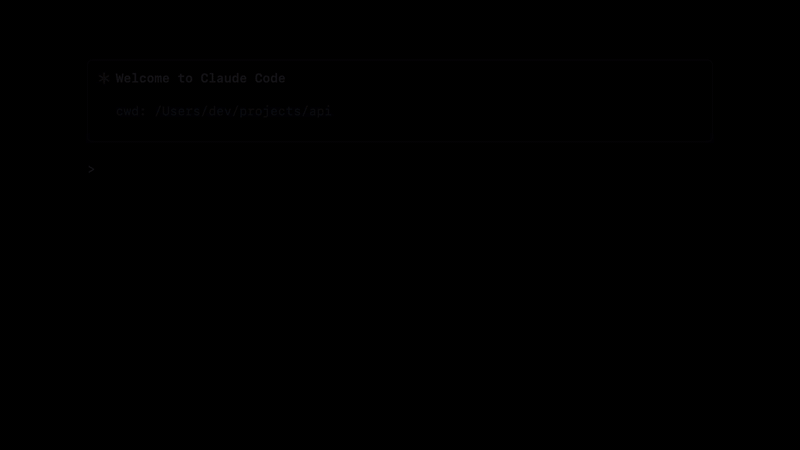
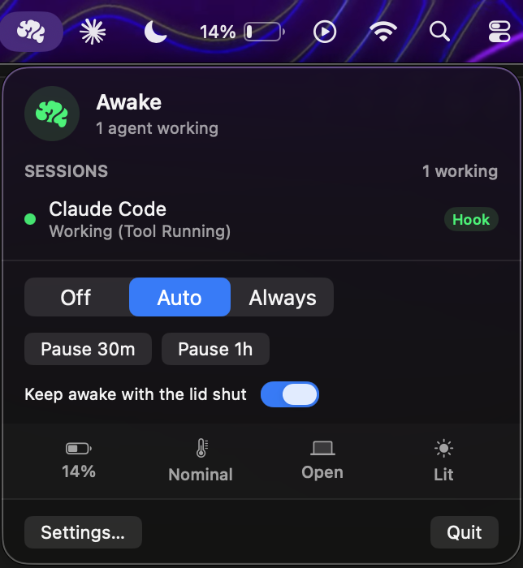
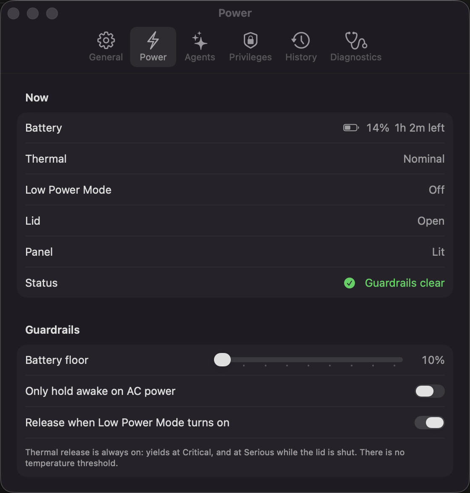
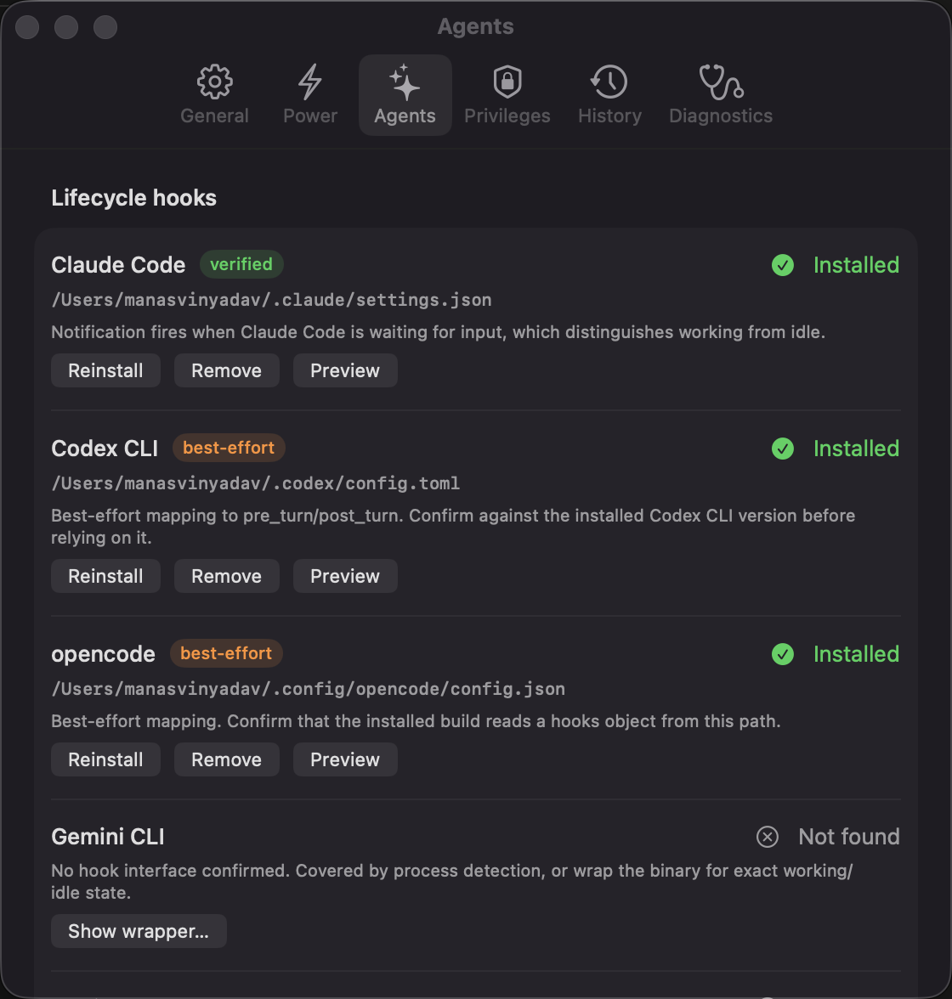
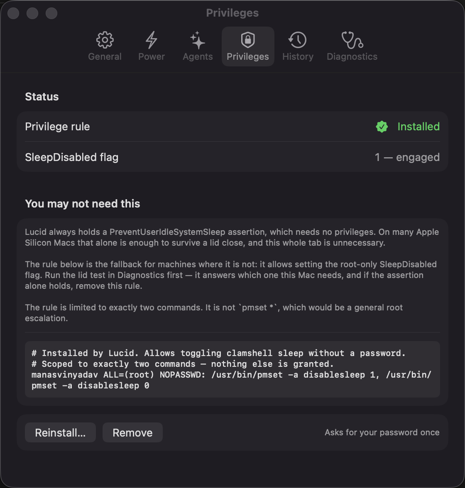
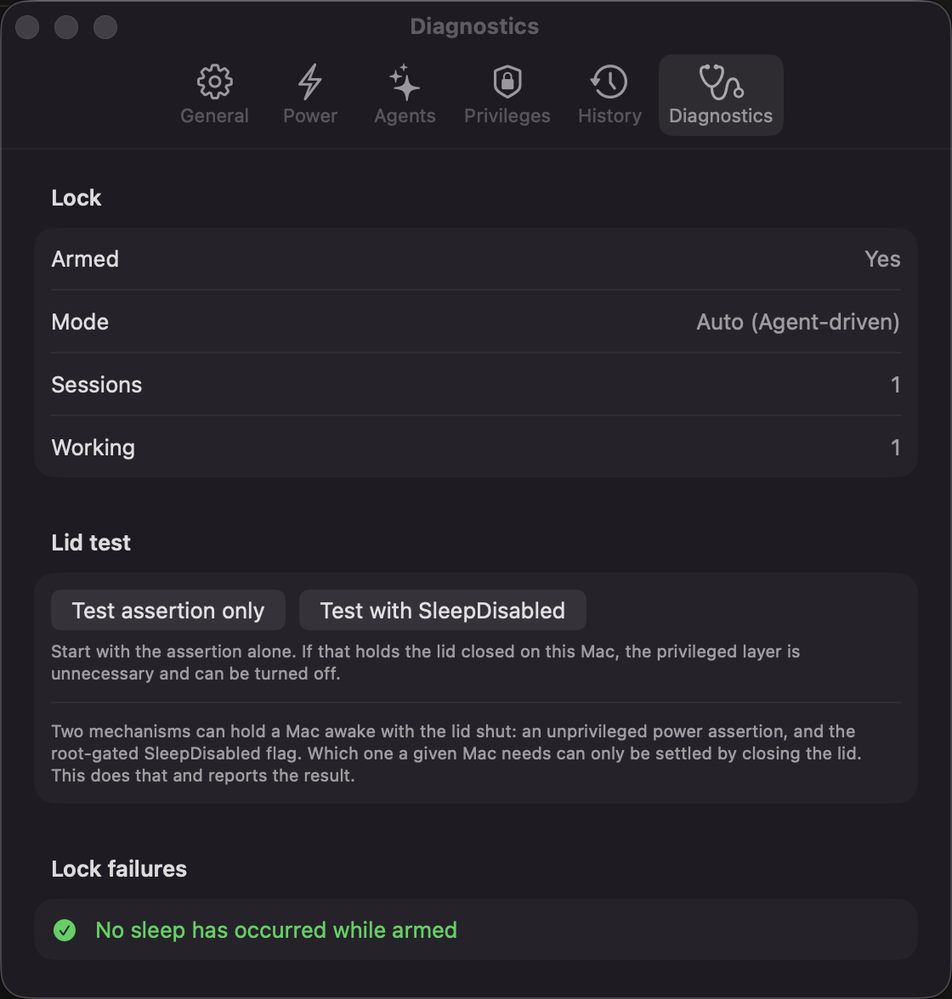

<div align="center">

<picture>
  <source media="(prefers-color-scheme: dark)" srcset="assets/wordmark.png">
  
</picture>

### Looks asleep. Isn't.

Keeps an Apple Silicon Mac awake with the lid closed **while an AI coding agent is actually
working**, and lets it sleep the moment the agent is just waiting for you.



<table><tr><td><b>Caffeine</b></td><td>is a switch.</td></tr>
<tr><td><b>Amphetamine</b></td><td>watches CPU.</td></tr>
<tr><td><b><i>lucid</i></b></td><td>listens to the agent.</td></tr></table>

</div>

---

## Why this exists

Every other keep-awake tool has to guess. A running `ollama`, an open Claude Code window, a
CPU spike — none of them tell you whether work is happening. Sitting at a prompt for twenty
minutes looks exactly like generating for twenty minutes, so either your Mac never sleeps or
it sleeps mid-build.

Lucid does not guess. Coding agents emit lifecycle events, and Lucid listens to them
directly: `working` when a turn starts or a tool runs, `idle` the moment the agent goes back
to waiting for you. That single distinction is the whole product.

## Install

```bash
brew install --cask manasvinyadav/lucid/lucid
```

Or grab the DMG from [Releases](https://github.com/ManasvinYadav/Lucid/releases/latest) and
drag Lucid to Applications.

**Lucid is not notarised yet**, so Gatekeeper will refuse it on first launch. Clear the
quarantine flag once:

```bash
xattr -dr com.apple.quarantine /Applications/Lucid.app
```

Notarisation needs a paid Apple Developer account. That is exactly what the
[sponsor goal](#sponsor) is for.

Requires macOS 14 or later on Apple Silicon.

## Lucid vs Amphetamine vs Caffeine

Checked against each product's own documentation, not assumed.

| | Caffeine | Amphetamine | Lucid |
|---|:---:|:---:|:---:|
| Prevents idle sleep | yes | yes | yes |
| Survives a lid close | no | yes | yes |
| …without an external display, keyboard or charger | — | yes | yes |
| Starts and stops on its own | no | yes | yes |
| What decides that | nothing, you click it | app running, CPU %, network, drive, audio, battery, idle timer | the agent's own lifecycle events |
| Tells *generating* apart from *waiting at a prompt* | no | no | **yes** |
| Battery floor / AC-only / Low Power Mode / thermal release | no | battery trigger | all four |
| Per-session history and an away report | no | no | yes |
| Open source | no | no | yes |
| Price | free | free | free |

Amphetamine is a genuinely good app with a much broader trigger list, and its closed-display
mode needs no charger or second display either. The one thing it cannot do — because no
trigger exposes it — is separate an agent that is generating from an agent that is waiting
for you. "This app is running" is true for the whole session, and a CPU threshold is
defeated by any network-bound tool call. That gap is the only comparative claim Lucid makes.

## Screenshots

<div align="center">

</div>

| | |
|---|---|
|  |  |
|  |  |

## How it works

Three layers, deliberately separate because they differ in privilege and blast radius.

1. **A power assertion** (`PreventUserIdleSystemSleep`) — unprivileged, always held while
   armed. Stops idle sleep. On many Apple Silicon Macs this alone survives a lid close.
2. **The `SleepDisabled` flag** — root-gated, and only used if layer 1 is not enough on your
   machine. The Diagnostics tab tells you which one this Mac needs.
3. **Guardrails** — battery, AC, Low Power Mode and thermal, any of which release everything.

Display sleep is never asserted, so the panel still goes dark when you shut the lid.

### Why a power assertion is not enough on its own

macOS treats a lid close as a *demand* sleep and never consults assertions.
`kIOPMAssertionTypePreventSystemSleep` has been a documented no-op since 10.9 — it returns
success and does nothing. The only lever that vetoes clamshell sleep is the `SleepDisabled`
system flag, which is root-only. Lucid installs a sudoers rule scoped to exactly two
commands:

```
<user> ALL=(root) NOPASSWD: /usr/bin/pmset -a disablesleep 1, /usr/bin/pmset -a disablesleep 0
```

One password prompt, ever, from **Settings → Privileges**. Nothing else is granted. This is
deliberately not `pmset *`, which would be a general root escalation. Skip it and the app
still works, limited to idle sleep with the lid open.

## First run

A setup window opens the first time you launch, covering the three things that cannot happen
silently:

1. **Lid-close support** — installs the sudoers rule (one password prompt)
2. **Agent hooks** — previews the change, then merges into `~/.claude/settings.json`
3. **Launch at login** — writes a LaunchAgent

Every step also lives permanently in Settings, under Privileges, Agents and General.

## Hooks

```bash
./hooks/install-hooks.sh            # preview, writes nothing
./hooks/install-hooks.sh --apply    # merge into ~/.claude/settings.json (backs up first)
./hooks/install-hooks.sh --uninstall
```

Merges into your existing hooks rather than replacing them, and is idempotent.

| Claude Code event | Sent | Why |
|---|---|---|
| `UserPromptSubmit` | `working` | Turn begins |
| `PreToolUse` / `PostToolUse` / `PostToolUseFailure` | `working` | Doubles as a heartbeat for long tool runs |
| `SubagentStart` / `SubagentStop` | `working` | Background agents count as work |
| `Notification` | `idle` | Fires when Claude Code is waiting for input |
| `Stop` | `idle` | Turn complete |
| `SessionEnd` | `ended` | Reap the session |

### Other agents

The wire protocol is one line of JSON to `~/.lucid/agent.sock`, a Unix domain socket at mode
0600 inside a 0700 directory — not a loopback TCP port, which any process or web page could
reach.

```json
{"agent":"codex","session_id":"abc","status":"working","detail":"Tool Running"}
```

`status` is `working` | `idle` | `ended`. Use the bundled client:

```sh
~/.lucid/lucid-notify <agent> <working|idle|ended> [detail]
```

It never blocks, never fails the calling agent, and always exits 0.

**Codex CLI** — in `~/.codex/config.toml`:
```toml
[hooks]
pre_turn  = '~/.lucid/lucid-notify codex working "Turn"'
post_turn = '~/.lucid/lucid-notify codex idle "Waiting for prompt"'
```

**Any CLI without a hook system** — wrap it:
```sh
#!/bin/sh
export LUCID_SESSION_ID=$$
~/.lucid/lucid-notify "$AGENT" working "Running"
trap '~/.lucid/lucid-notify "$AGENT" ended' EXIT
exec real-agent-binary "$@"
```

**GUI tools with no hooks** (Cursor, Cline) fall back to process activity, and are badged
`Process` in the menu so an inferred state is never mistaken for a reported one.

## Guardrails

All public API, entitlement-free, event-driven — no polling.

- **Battery floor** (10–50% slider) — releases below the threshold on battery
- **AC-only mode** — only hold awake while plugged in
- **Low Power Mode** — yields immediately when it turns on
- **Thermal** — yields on `.critical`, and on `.serious` while the lid is shut
- **Lid-closed cap** — an optional ceiling on how long the lock may hold with the lid shut

There is deliberately **no °C threshold**. Apple Silicon runs 70–100 °C by design and
self-throttles in hardware, and die temperature does not track the thermal pressure macOS
reports. A degrees threshold either never fires or fires constantly.

## Safety

`SleepDisabled` persists across reboot, so a crash while armed could leave the Mac unable to
sleep. Three teardown paths cover it:

- `atexit` for normal termination
- `DispatchSource` signal handlers for `SIGTERM` / `SIGINT` / `SIGHUP`
- An **arm-marker file** (`~/.lucid/armed`) for `kill -9` — if it survives to the next
  launch, the app clears `SleepDisabled` and says so

Sessions carry a **TTL** (default 5 min). An agent that dies without sending `idle` is reaped
and the Mac becomes sleepable again. Without this, one `kill -9`'d agent would pin it awake
forever.

Launch at login uses a plain LaunchAgent rather than `SMAppService.mainApp`, whose designated
requirement is the code's cdhash — it changes on every ad-hoc rebuild, leaving stale
duplicate registrations in BTM.

## Build from source

```bash
./build.sh
open build/Lucid.app
```

No Xcode project, no SPM, no dependencies — one `swiftc` call plus a bundle, ad-hoc signed.
The app icon is generated from code by `tools/wordmark.swift`; there is no asset catalog.

## Debugging

```bash
build/Lucid.app/Contents/MacOS/Lucid --selftest        # every signal, asserted
build/Lucid.app/Contents/MacOS/Lucid --login-item on   # or off
cat ~/.lucid/status.json                               # live state, rewritten on change
pmset -g assertions | grep Lucid                       # what the OS thinks we hold
pmset -g | grep SleepDisabled                          # the lid-close flag
```

To inspect the UI without Screen Recording:

```bash
swiftc -O -target arm64-apple-macos14.0 -D DEBUG_RENDER \
  -framework SwiftUI -framework AppKit -framework IOKit \
  -framework Carbon -framework UserNotifications \
  -o /tmp/LucidRender Sources/*.swift
/tmp/LucidRender --render-settings /tmp/ui
```

Dumps each settings pane and the menu to PNG by capturing the real AppKit view hierarchy via
`cacheDisplay`. Compiled out of normal builds.

## Why not GPU utilisation

`Device Utilization %` commonly sits in the 20–40% range on an idle desktop, dominated by
WindowServer. There is no threshold that separates inference from a scrolling browser.
Per-PID GPU accounting via `AGXDeviceUserClient` does work, but it still cannot tell
"generating" from "waiting at a prompt" — only a lifecycle hook can.

## Sponsor

Lucid is free and always will be. The one thing it needs money for is an
**Apple Developer membership at $99/year**, which is what allows the app to be notarised —
so it installs without the `xattr` dance above and without a Gatekeeper warning.

**[Sponsor this project](https://github.com/sponsors/ManasvinYadav)** — the goal is $99, and
that is the whole goal.

## Credits

- Wordmark set in [Borel](https://github.com/RosaWagner/Borel), copyright 2023 The Borel
  Project Authors, [SIL Open Font License 1.1](assets/fonts/OFL.txt). Vendored in
  `assets/fonts/`.
- The film's music is *Convergence* by [Scott Buckley](https://www.scottbuckley.com.au),
  licensed [CC BY 4.0](https://creativecommons.org/licenses/by/4.0/). Used in
  `media/Lucid-music.mp4`; `media/Lucid.mp4` is the silent cut.
- The film itself is generated from code — see `media/Film.swift`.

## License

[MIT](LICENSE)
